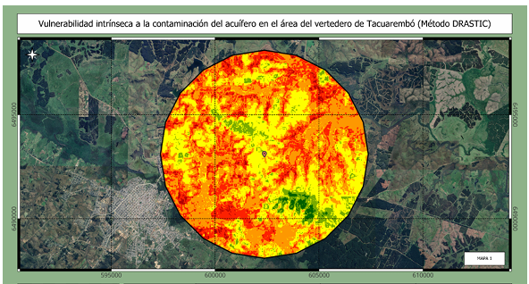
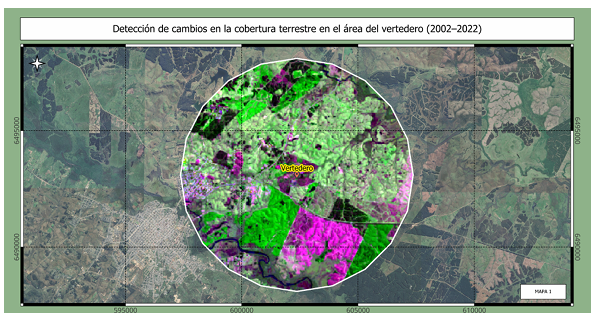
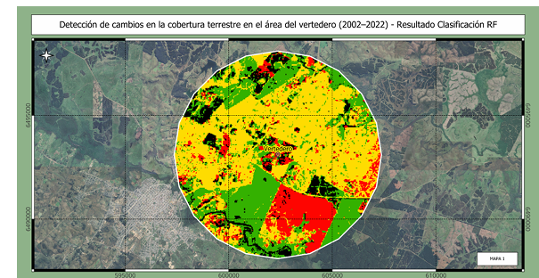
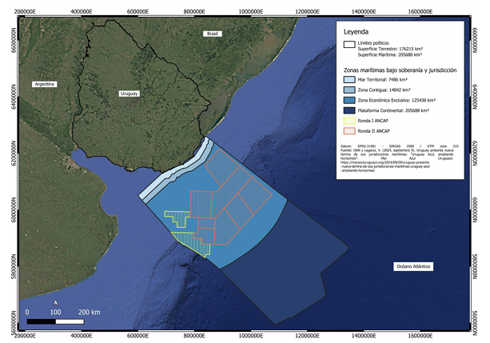
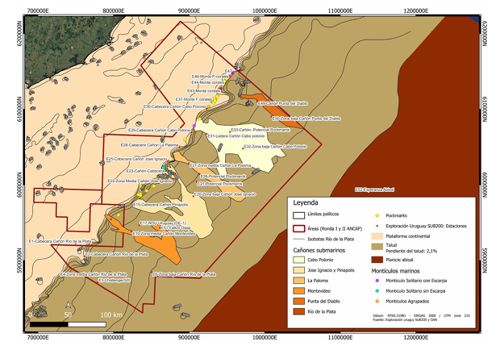
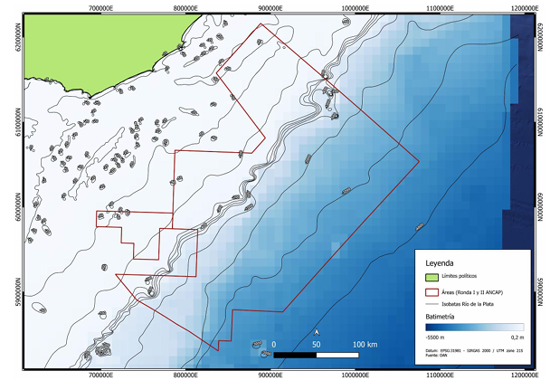
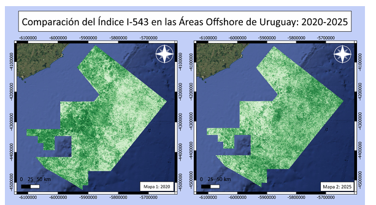
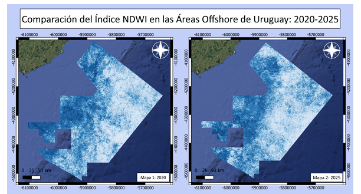

# ejemplos-entregas/

Ejemplos anonimizados de entregas de estudiantes de Ordenamiento Ambiental, mostrando la aplicación de las técnicas del curso sobre áreas de estudio elegidas libremente por cada uno. No se incluye ningún dato identificatorio de los autores (nombre, número de grupo, correo).

## Vertedero de Tacuarembó

Entrega correspondiente a los Trabajos 2 (detección de cambios) y 3 (GOD/DRASTIC), aplicados al área de influencia del vertedero de Tacuarembó.

Mapa de vulnerabilidad intrínseca a la contaminación del acuífero (método DRASTIC) en el área del vertedero.

Detección de cambios en la cobertura terrestre en el área del vertedero, período 2002-2022, previo a la clasificación.

Resultado de la clasificación de cambios de cobertura mediante Random Forest sobre el mismo período y área de estudio.

## Áreas offshore de Uruguay

Entrega que integra técnicas de los cuatro trabajos prácticos (análisis temporal de índices espectrales, detección de cambios, y cartografía geomorfológica) aplicadas a un caso de estudio propio y considerablemente ampliado por el estudiante: las áreas marítimas offshore de Uruguay bajo exploración de ANCAP (Ronda I y II).

Mapa base de las zonas marítimas bajo soberanía y jurisdicción de Uruguay (mar territorial, zona contigua, zona económica exclusiva, plataforma continental) y las áreas de exploración ANCAP Ronda I y II.

Cartografía geomorfológica del talud continental, con identificación de cañones submarinos y montículos marinos.

Mapa batimétrico de las áreas de exploración, con isóbatas del Río de la Plata.

Comparación temporal del índice espectral I-543 en las áreas offshore, 2020 vs. 2025.

Comparación temporal del índice NDWI (Normalized Difference Water Index) en las áreas offshore, 2020 vs. 2025.
