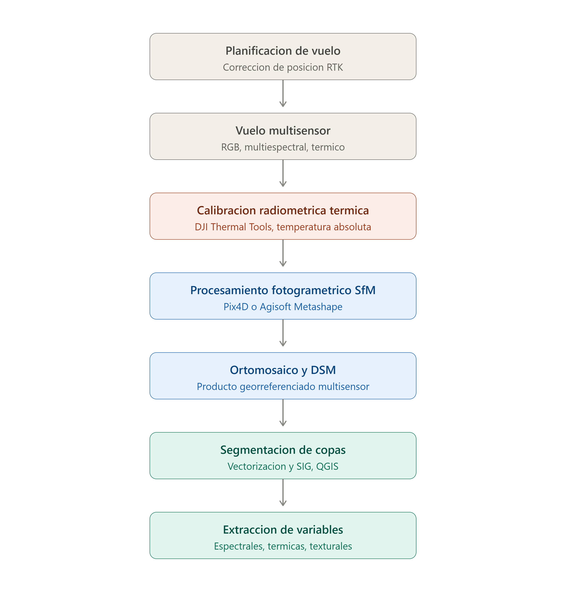

# Fotogrametría UAV multisensor para caracterización fenotípica de palmeras: Detección temprana de picudo rojo

## Contexto

Trabajo de campo y procesamiento fotogramétrico desarrollado en el marco de la línea de investigación del Grupo de Investigaciones Espaciales (GIEx, UTEC) sobre detección temprana de picudo rojo (*Rhynchophorus ferrugineus*) en palmeras *Phoenix canariensis*, en sitios piloto de Montevideo. Constituye la etapa preliminar de fotogrametría UAV y generación de ortomosaicos sobre la cual se apoya el desarrollo posterior de modelos de clasificación del estado sanitario de los ejemplares.

## Mi rol en el proyecto

Planificación y ejecución de misiones de vuelo UAV. Procesamiento fotogramétrico completo: ensamblaje de imágenes, calibración radiométrica y generación de nubes de puntos, modelos digitales de superficie (DSM) y ortomosaicos georreferenciados. Vectorización y delimitación de palmeras individuales mediante SIG para su georreferenciación y análisis espacial. Preparación y estandarización de matrices ráster para su integración en modelos analíticos posteriores.

## Metodología

**Adquisición de datos.** Siguiendo los fundamentos establecidos por Berni et al. (2009) para plataformas UAV livianas con sensores multiespectrales y térmicos, se ejecutan misiones de vuelo con solapamiento frontal y lateral igual o superior al 80%, en condiciones atmosféricas homogéneas, con calibración radiométrica mediante paneles de reflectancia antes y después de cada vuelo, según los protocolos de Zarco-Tejada et al. (2012).

**Posicionamiento RTK.** El posicionamiento estándar de un GNSS embarcado en UAV tiene una precisión del orden de metros, insuficiente para la georreferenciación directa que requiere este tipo de trabajo (delimitación de copas individuales, comparación multitemporal de la misma palmera). Por eso la posición de cada imagen se corrige mediante RTK (Real-Time Kinematic) en posprocesamiento: los datos crudos de posicionamiento del UAV se corrigen contra los de una estación base GNSS fija, llevando la precisión a nivel centimétrico antes del procesamiento fotogramétrico. Esta corrección reduce sustancialmente el error de geolocalización de cámara y de mapeo absoluto respecto al posicionamiento GNSS estándar, incluso sin depender de puntos de control terrestre (GCP) adicionales.

**Procesamiento fotogramétrico.** Las imágenes se procesan mediante técnicas de estructura a partir de movimiento (Structure from Motion) para generar ortomosaicos georreferenciados de alta resolución y modelos digitales de superficie.

**Procesamiento radiométrico de imágenes térmicas — temperatura absoluta vs. relativa.** Este es un paso metodológico crítico y frecuentemente subestimado en fotogrametría térmica UAV. El ensamblaje directo de imágenes térmicas en un software de fotogrametría genérico produce un ortomosaico de temperatura relativa: los valores de píxel reflejan diferencias internas de radiancia entre imágenes, pero no representan temperaturas físicas reales, y no son comparables entre vuelos ni contra umbrales absolutos. Para obtener temperatura absoluta (imprescindible en un sistema de detección basado en umbrales de temperatura de copa), es necesario aplicar calibración radiométrica antes del ensamblaje: corrección de la respuesta del sensor, de la temperatura de fondo reflejada, de la emisividad del objetivo, y de la atenuación atmosférica en función de la distancia, temperatura y humedad relativa del aire en el momento del vuelo. Esta calibración se realiza con DJI Thermal Tools, que exporta los valores de radiancia calibrados por imagen a partir de los parámetros de fábrica embebidos en los metadatos térmicos, antes de que las imágenes ingresen al pipeline fotogramétrico. Sin este paso, cualquier análisis que dependa de un valor absoluto de temperatura (y no solo de contraste relativo dentro de una misma imagen) queda inválido.

**Delimitación de copas individuales.** Se aborda mediante un enfoque híbrido: análisis de imagen orientado a objetos (OBIA) como línea base, complementado con modelos de segmentación basados en arquitecturas de visión fundacionales, en la línea de los transformers de visión propuestos por Gibril et al. (2023) para segmentación a gran escala de palmeras datileras por UAV, un enfoque que reduce la dependencia de umbrales manuales en dosel urbano denso y heterogéneo.

**Extracción de variables.** Para cada copa segmentada se calculan índices espectrales de banda estrecha (NDVI, GNDVI, NDRE), estadísticas de temperatura de copa, métricas de textura derivadas de matrices de co-ocurrencia, y atributos estructurales obtenidos del modelo digital de superficie, insumos que luego alimentan los modelos de clasificación del estado sanitario.

## Workflow

1. **Planificación de vuelo.** Diseño de misión con solapamiento ≥80% frontal/lateral, según Berni et al. (2009), en condiciones atmosféricas homogéneas.
2. **Adquisición multisensor.** Captura simultánea RGB, multiespectral y térmica con la plataforma UAV (DJI Matrice 300), incluyendo calibración con paneles de reflectancia antes y después del vuelo.
3. **Corrección de posición RTK.** Posprocesamiento de la posición de cada imagen contra una estación base GNSS fija, llevando la precisión a nivel centimétrico.
4. **Calibración radiométrica térmica.** Extracción de temperatura absoluta por imagen con DJI Thermal Tools, previa al ensamblaje fotogramétrico — paso obligatorio antes del siguiente punto, dado que el ensamblaje directo de imágenes térmicas sin calibrar produce solo temperatura relativa.
5. **Procesamiento fotogramétrico (SfM).** Ensamblaje de imágenes RGB, multiespectrales y térmicas calibradas mediante Structure from Motion (Pix4D / Agisoft Metashape), generando nube de puntos, DSM y ortomosaicos georreferenciados por banda.
6. **Delimitación de copas individuales.** Segmentación híbrida OBIA + modelos de visión (línea Gibril et al., 2023) sobre el ortomosaico RGB/multiespectral.
7. **Extracción de variables por copa.** Cálculo de índices espectrales (NDVI, GNDVI, NDRE), estadísticas de temperatura, métricas de textura y atributos estructurales del DSM para cada palmera segmentada.
8. **Preparación de matrices ráster.** Estandarización de las variables extraídas como insumo para los modelos de clasificación del estado sanitario (etapa posterior, fuera del alcance de este repositorio).

## Herramientas

- **Plataforma UAV** (DJI Matrice 300) con sensores RGB, multiespectral y térmico embarcados, con corrección de posición RTK.
- **Pix4D** y **Agisoft Metashape** — procesamiento fotogramétrico SfM (generación de nube de puntos, DSM, ortomosaico).
- **DJI Thermal Tools** — calibración radiométrica de imágenes térmicas (extracción de temperatura absoluta previa al ensamblaje fotogramétrico).
- **QGIS** — vectorización, georreferenciación y análisis espacial de copas individuales.
- **Python** para extracción de variables espectrales/texturales y preparación de matrices ráster.

## Referencias

**Adquisición y procesamiento fotogramétrico:**

- Berni, J. A. J.; Zarco-Tejada, P. J.; Suárez, L.; Fereres, E. (2009). Thermal and narrowband multispectral remote sensing for vegetation monitoring from an unmanned aerial vehicle. *IEEE Transactions on Geoscience and Remote Sensing*, 47(3), 722–738.
- Zarco-Tejada, P. J.; González-Dugo, V.; Berni, J. A. J. (2012). Fluorescence, temperature and narrow-band indices acquired from a UAV platform for water stress detection using a micro-hyperspectral imager and a thermal camera. *Remote Sensing of Environment*, 117, 322–337.

**Corrección de posición RTK/PPK:**

- Ekaso, D.; Nex, F.; Kerle, N. (2020). Accuracy assessment of real-time kinematics (RTK) measurements on unmanned aerial vehicles (UAV) for direct geo-referencing. *Geo-Spatial Information Science*, 23(2), 165–181.
- Cledat, E.; Jospin, L. V.; Cucci, D. A.; Skaloud, J. (2020). Mapping quality prediction for RTK/PPK-equipped micro-drones operating in complex natural environment. *ISPRS Journal of Photogrammetry and Remote Sensing*, 167, 24–38.
- Benassi, F.; Dall'Asta, E.; Diotri, F.; Forlani, G.; Morra di Cella, U.; Roncella, R.; Santise, M. (2017). Testing accuracy and repeatability of UAV blocks oriented with GNSS-supported aerial triangulation. *Remote Sensing*, 9(2), 172.

**Calibración radiométrica térmica (temperatura absoluta vs. relativa):**

- Torres-Rua, A. (2017). Vicarious calibration of sUAS microbolometer temperature imagery for estimation of radiometric land surface temperature. *Sensors*, 17(7), 1499.
- Mesas-Carrascosa, F.-J.; Pérez-Porras, F.; Meroño de Larriva, J. E.; Mena Frau, C.; Agüera-Vega, F.; Carvajal-Ramírez, F.; Martínez-Carricondo, P.; García-Ferrer, A. (2018). Drift correction of lightweight microbolometer thermal sensors on-board unmanned aerial vehicles. *Remote Sensing*, 10(4), 615.
- Aragon, B.; Johansen, K.; Parkes, S.; Malbeteau, Y.; Almashharawi, S.; Al-Amoudi, T.; Andrade, C. F.; Turner, D.; Lucieer, A.; McCabe, M. F. (2020). A calibration procedure for field and UAV-based uncooled thermal infrared instruments. *Sensors*, 20(11), 3316.
- Lee, K.; Lee, W. (2026). High-resolution thermal mapping for quantitative UAV–TIR applications: a methodological review of sensor integration, calibration, and data processing decisions. *Aerospace*, 13(5), 430.

**Segmentación de copas individuales:**

- Gibril, M. B. A.; Shafri, H. Z. M.; Al-Ruzouq, R.; Shanableh, A.; Nahas, F.; Al Mansoori, S. (2023). Large-scale date palm tree segmentation from multiscale UAV-based and aerial images using deep vision transformers. *Drones*, 7(2), 93.

**Detección de estado sanitario en palmeras:**

- Casas, E.; Arbelo, M.; Moreno-Ruiz, J. A.; Hernández-Leal, P. A.; Reyes-Carlos, J. A. (2023). UAV-based disease detection in palm groves of *Phoenix canariensis* using machine learning and multispectral imagery. *Remote Sensing*, 15(14), 3584.

