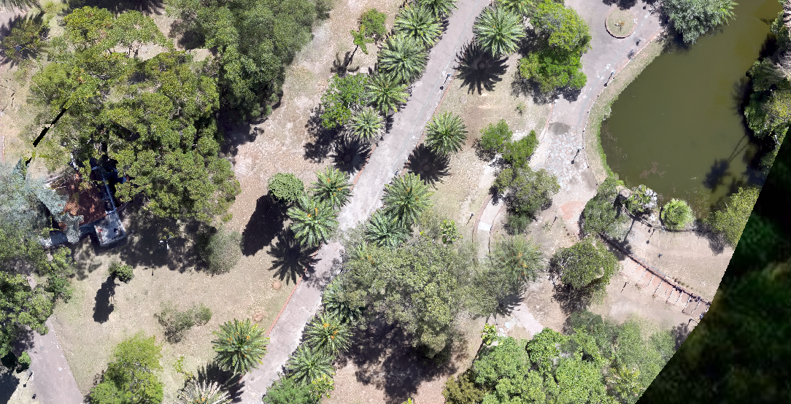
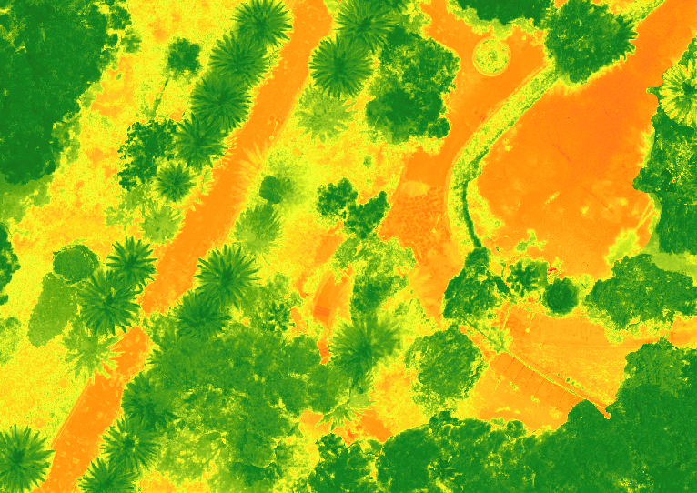
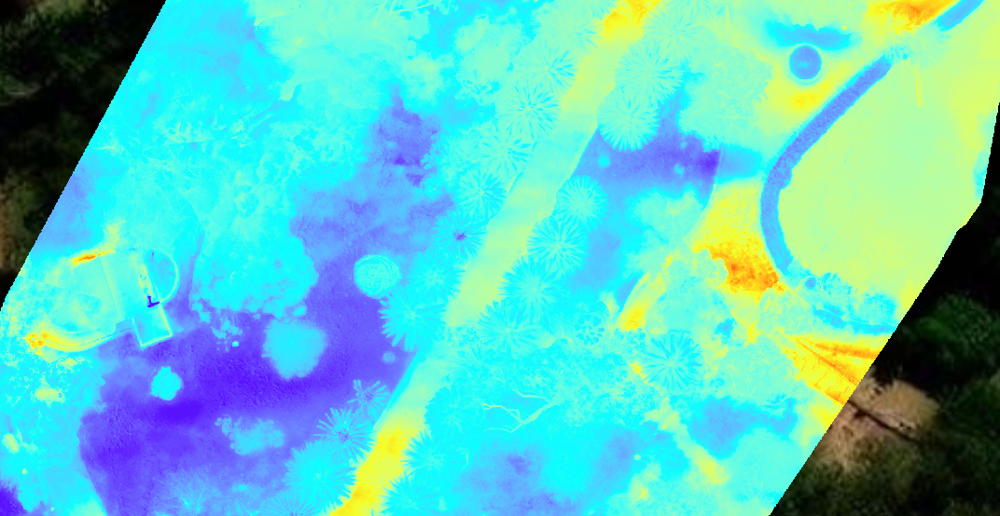
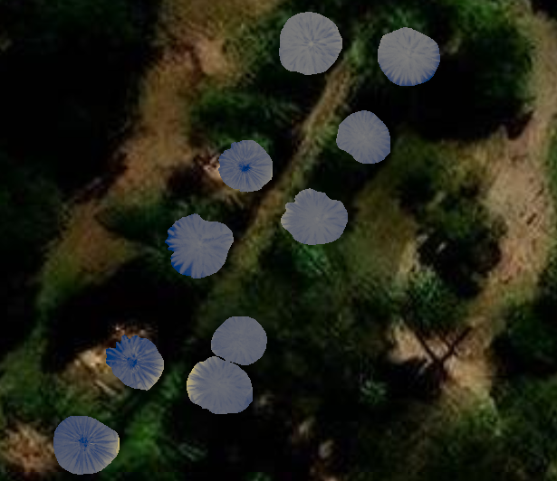
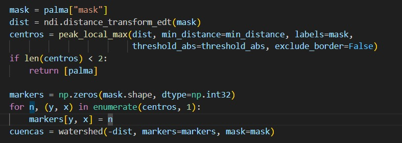
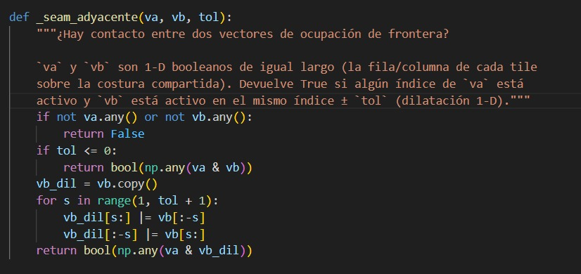
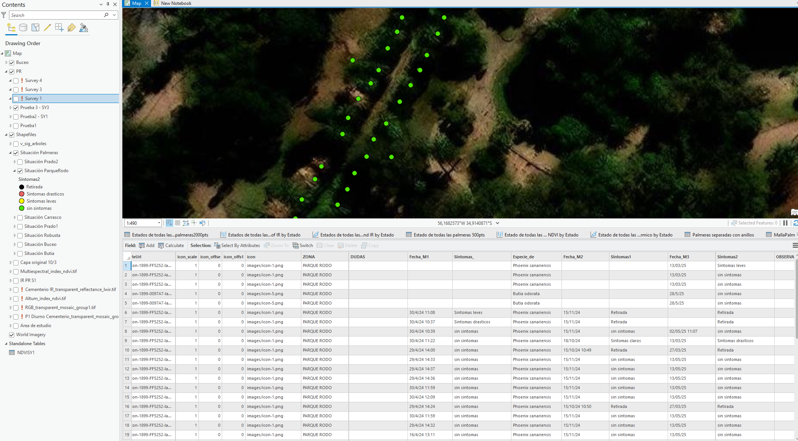

# Resultados

Productos derivados del procesamiento fotogramétrico multisensor: ortomosaicos por banda, segmentación automática de copas individuales y verificaciones de calidad del pipeline de delimitación.

## Contenido

### 1–3. Ortomosaicos por sensor

Ortomosaico RGB georreferenciado, generado por Structure from Motion (Pix4D / Agisoft Metashape).

Ortomosaico multiespectral, insumo para el cálculo de índices espectrales (NDVI, GNDVI, NDRE) por copa.

Ortomosaico térmico, generado a partir de imágenes calibradas radiométricamente con DJI Thermal Tools (temperatura absoluta, no relativa).

### 4. Segmentación automática de copas

Resultado de la delimitación automática de copas individuales mediante el enfoque híbrido OBIA + modelos de segmentación basados en visión (línea Gibril et al., 2023).

### 5–6. Verificaciones de calidad de la segmentación

Caso de verificación: el algoritmo separa correctamente copas de palmeras adyacentes o con solapamiento de follaje, evitando que se fusionen en una sola detección.

Verificación de que una copa de palmera ubicada sobre el borde compartido entre dos tiles del ortomosaico se reconstruye correctamente como una única unidad, sin fragmentarse en dos detecciones separadas.

### 7. Vectorización final

Shapefile final de palmeras individuales vectorizadas y georreferenciadas, listo para la extracción de variables por copa y su integración en los modelos de clasificación del estado sanitario.

---

**Nota:** estas imágenes documentan productos y verificaciones de calidad del pipeline de fotogrametría y segmentación, no resultados de clasificación sanitaria (etapa posterior, fuera del alcance de este repositorio).
