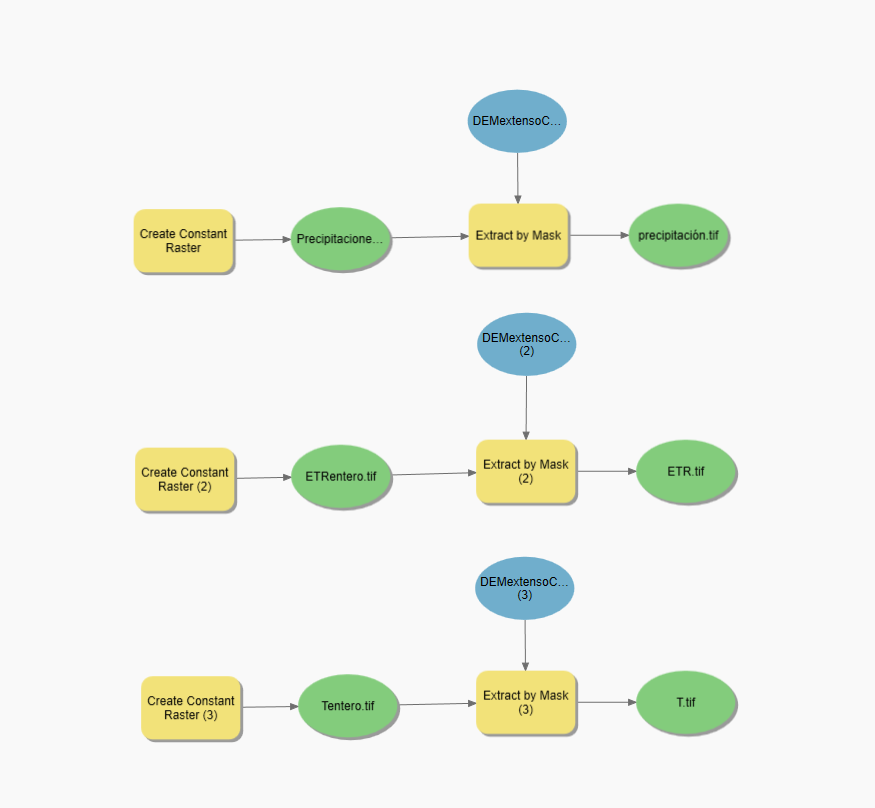
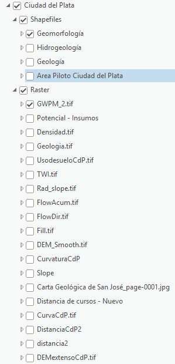
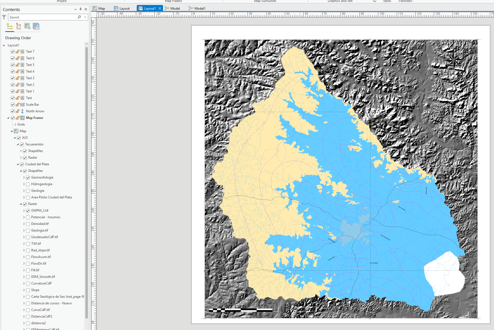
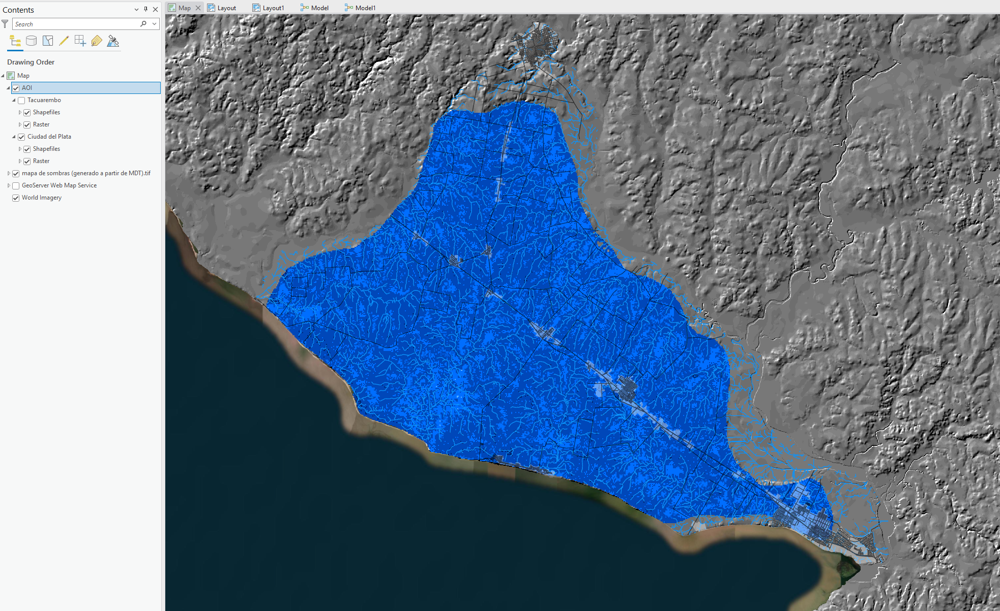

# Resultados

Capturas del flujo de trabajo en ArcGIS Pro para el cálculo del GWPI: automatización en ModelBuilder, organización de capas del proyecto y preparación del layout final. No se incluyen los mapas oficiales del informe (ver nota en el README principal).

## Contenido

### 1–2. Automatización en ModelBuilder

Flujo de ModelBuilder para la generación automatizada del Groundwater Potential a formato raster, incorporando los 12 criterios de la matriz AHP.

Automatización del proceso con ModelBuilder para generar las capas raster de clima (Temperatura, precipitación, etc.).

### 3. Organización del proyecto

Estructura y orden de las capas dentro del proyecto de ArcGIS Pro, reflejando la jerarquía de los 12 criterios utilizados en el análisis multicriterio.

### 4. Preparación del layout final

Vista de la preparación del layout (composición cartográfica: leyenda, escala, orientación) previo a la exportación del mapa final.

### 5. Vista general del proyecto

Vista general del proyecto SIG completo, con el conjunto de capas de entrada integradas para el cálculo del GWPI.

---

**Nota:** estas capturas documentan el proceso metodológico (ModelBuilder, estructura de capas, preparación cartográfica) y no reproducen mapas oficiales del informe final, actualmente en proceso de publicación.
