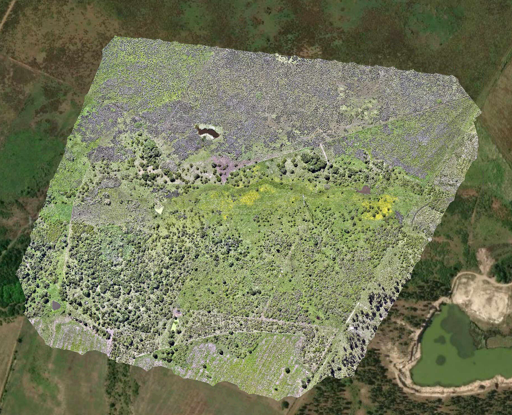
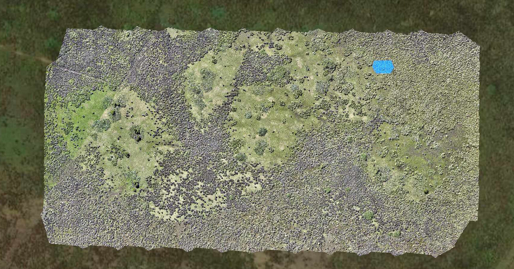
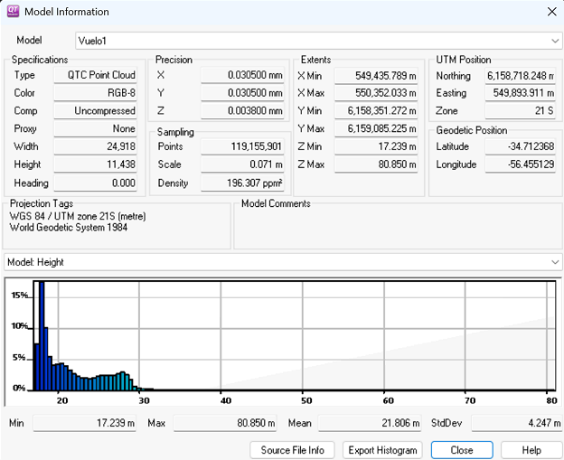
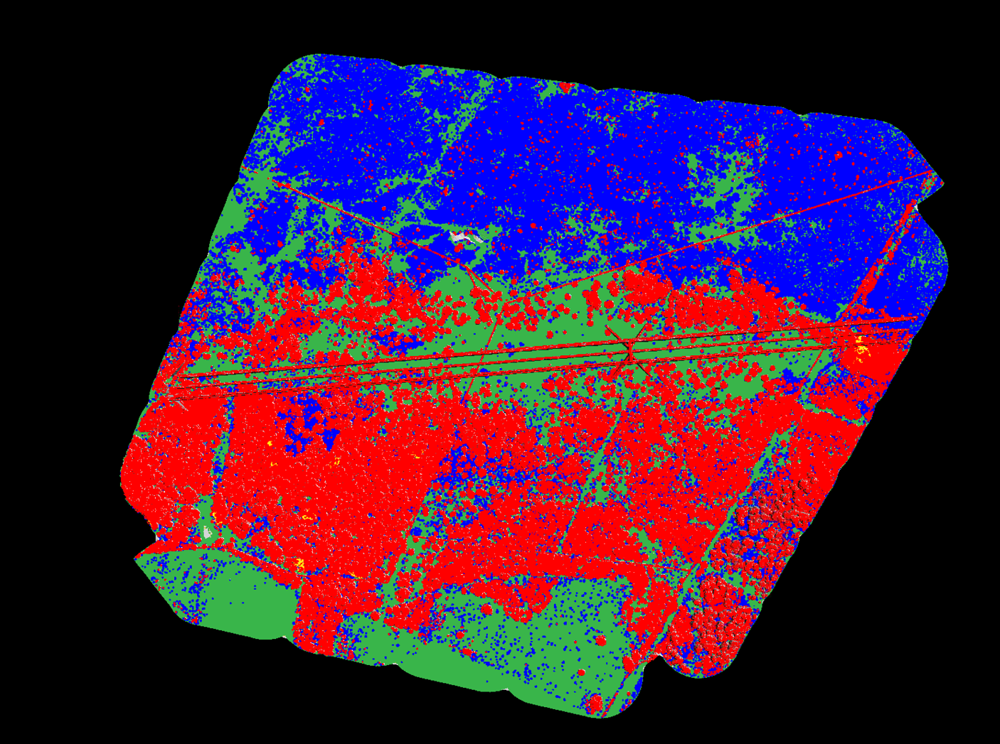
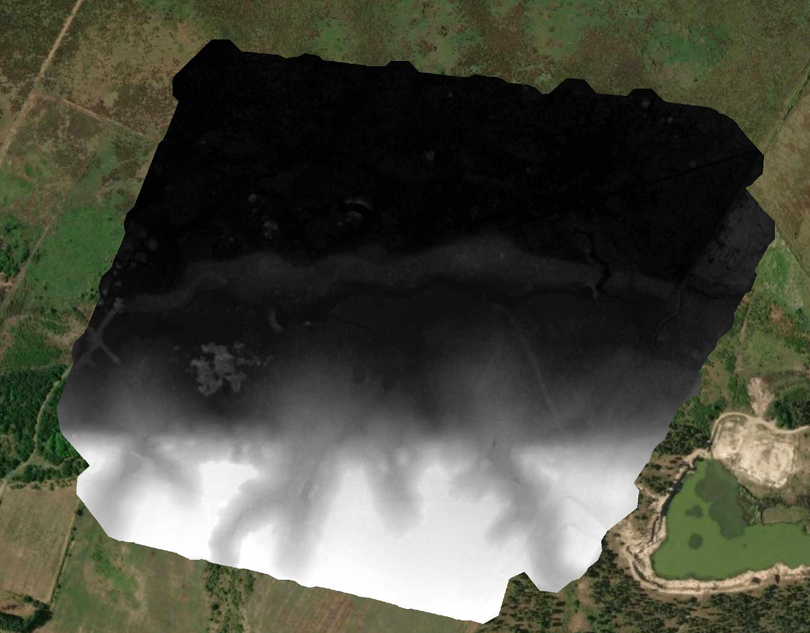
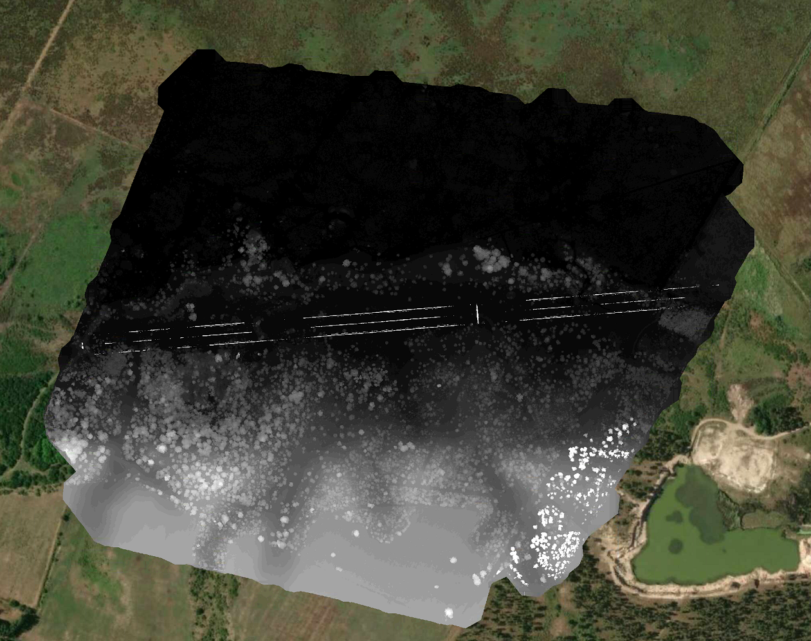
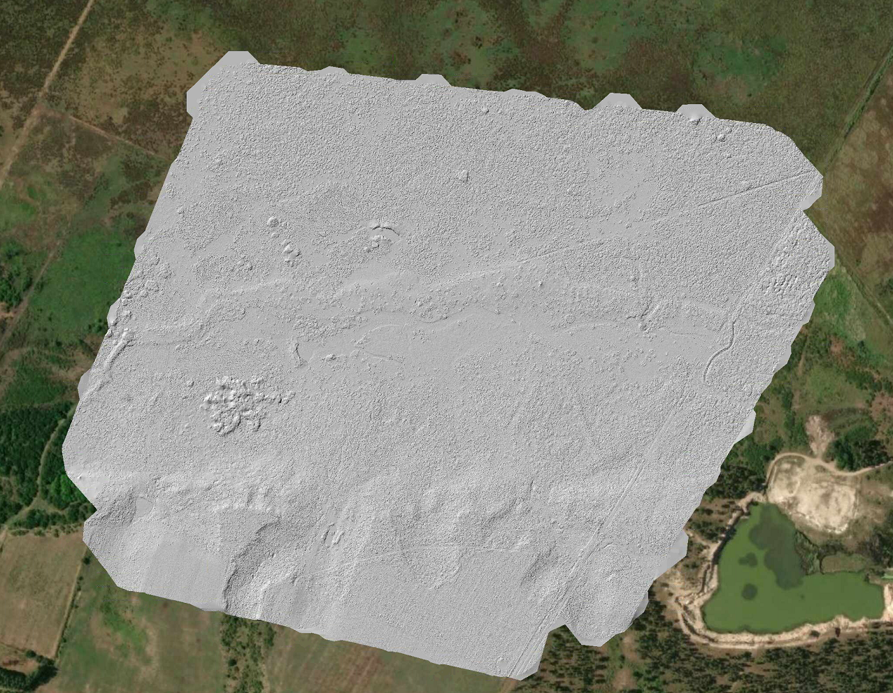
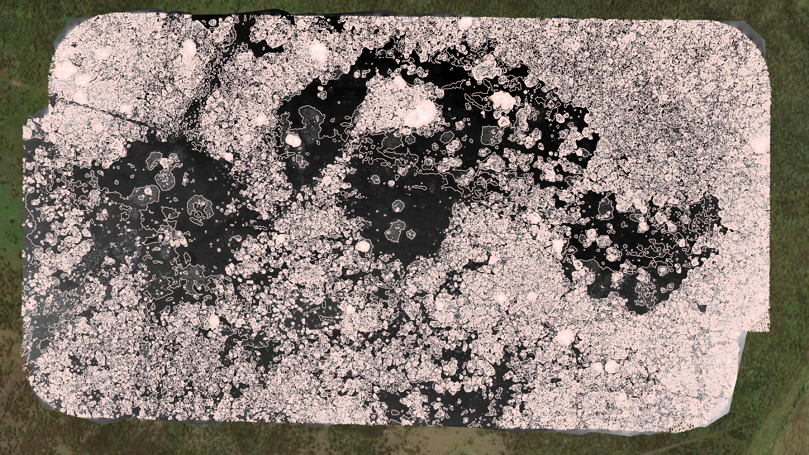
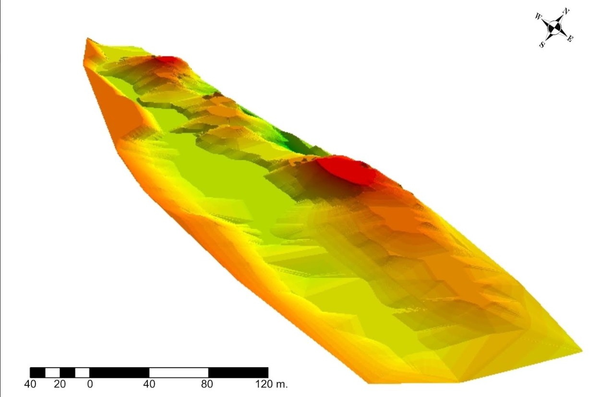

# resultados/

Productos derivados del procesamiento de la nube de puntos LiDAR: clasificación, modelos de elevación (DEM/DSM), visualización de microrelieve y comparación contra el registro fotogramétrico previo del sitio (2011). No se incluyen coordenadas exactas ni cartografía de detalle (ver nota de datos sensibles en el README principal).

## Contenido

### 1–2. Nube de puntos con color RGB

Nube de puntos LiDAR coloreada con la cámara RGB integrada del sensor DJI Zenmuse L2 (vista 1).

Vista adicional de la misma nube de puntos con color RGB.

### 3. Información de la nube de puntos

Metadatos y estadísticas generales de la nube de puntos cruda (densidad, extensión, atributos).

### 4. Clasificación de la nube de puntos

Resultado de la clasificación suelo / no-suelo en LiDAR360, paso previo a la generación de los modelos de elevación.

### 5–6. Modelos de elevación

Modelo Digital de Elevación (DEM) generado a partir de los puntos clasificados como suelo.

Modelo Digital de Superficie (DSM), incluyendo vegetación y estructuras.

### 7. Visualización de microrelieve

Hillshade del DEM, primera aproximación visual al microrelieve del sitio.

### 8. Curvas de nivel

Curvas de nivel generadas cada 0.1 m a partir del DEM, para el análisis de detalle del microrelieve de los concheros.

### 9. Comparación con registro fotogramétrico previo

DEM del sitio derivado de fotogrametría (2011), utilizado como registro de referencia preexistente para validar la detección LiDAR de las estructuras monticulares.

---

**Nota:** estas imágenes documentan productos técnicos del procesamiento LiDAR y no constituyen cartografía de detalle del sitio arqueológico.
